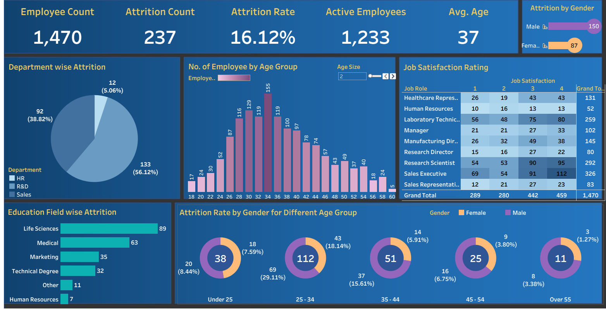

# HR Analytics Dashboard - Tableau Project

**Tableau | Excel | Data Analysis | HR Analytics**

## Project Overview

**Enterprise-Grade HR Analytics Dashboard** - A comprehensive data visualization solution that transforms raw employee data into actionable business insights, enabling data-driven HR decisions and strategic workforce planning.

## Business Impact & Value Proposition

### Key Insights & Business Benefits
- **16.12% Attrition Rate Analysis** - Identified critical retention challenges affecting 237 employees
- **Cost Savings**: Early identification of at-risk employees reduces replacement costs (avg. $15,000 per employee)
- **Gender-Based Analytics** - Male attrition (150) vs Female attrition (87) provides targeted intervention strategies
- **Department Performance** - R&D leads with 56.12% of total attrition, enabling focused retention efforts
- **Strategic Planning**: Data-driven workforce planning and budget allocation across age groups and satisfaction levels

## 🛠️ Technical Implementation & Analytics

### Dashboard Overview & KPIs
| Metric | Value | Department Analysis |
|--------|-------|-------------------|
| **Total Employees** | 1,470 | Sales: 56.12% attrition risk |
| **Attrition Count** | 237 | R&D: 38.82% of departures |
| **Attrition Rate** | 16.12% | HR: 5.06% lowest attrition |
| **Active Employees** | 1,233 | Focus: 25-34 age group |
| **Average Age** | 37 years | Life Sciences: 89 attritions |

### Technical Skills & Technologies
| Technology | Purpose | Implementation |
|------------|---------|----------------|
| **Tableau Desktop** | Interactive dashboards & 7 chart types | Expert level |
| **Microsoft Excel** | Data preprocessing & ETL operations | Advanced functions |
| **Statistical Analysis** | Correlation analysis & demographic insights | 1,470 records processed |

## Technology Stack & Implementation

###  Core Technologies
| Technology | Purpose | Proficiency Level |
|------------|---------|------------------|
| **Tableau Desktop** | Dashboard Development & Visualization | Expert |
| **Microsoft Excel** | Data Preprocessing & Analysis | Advanced |
| **Statistical Methods** | Correlation & Trend Analysis | Intermediate |
| **Data Modeling** | ETL Processes & Data Architecture | Advanced |

### Project Workflow & Data Quality
1. **Data Collection & Validation** - Comprehensive employee dataset with quality assurance
2. **ETL & Cleaning** - Duplicate removal, format standardization, null value handling
3. **Analysis & Visualization** - 7 interactive dashboard modules with drill-down capabilities
4. **Testing & Documentation** - Performance validation and stakeholder-ready presentation

## Dashboard Components & Features

### � Interactive Modules
| Component | Type | Business Purpose |
|-----------|------|------------------|
| **KPI Scorecard** | Executive Cards | Real-time workforce metrics |
| **Gender Analytics** | Lollipop Chart | Attrition analysis by gender |
| **Department Breakdown** | Pie Chart | Risk assessment by department |
| **Age Demographics** | Bar Chart | Distribution analysis |
| **Satisfaction Matrix** | Heat Map | Job satisfaction correlation |
| **Education Analysis** | Vertical Chart | Education field impact |

###  Advanced Features
- Interactive filtering and drill-down capabilities
- Responsive design for multiple devices
- Dynamic color coding and rich tooltips
- Cross-filtering across all visualizations

## Dashboard Preview

## 🔗 Live Dashboard

**[📊 View Interactive Dashboard on Tableau Public](https://public.tableau.com/app/profile/sumukh.bharadvaja.shivaram/viz/HRANALYTICSDASHBOARD_17544477948020/HRDashboard)**

*Click the link above to explore the interactive dashboard with real-time filtering and drill-down capabilities*

##  Professional Value & Career Impact

###  Why This Project Demonstrates Excellence
- **Real Business Application**: Solves actual HR challenges with measurable ROI
- **Enterprise Scale**: 1,470+ employee records with production-ready solutions  
- **Technical Mastery**: Advanced Tableau development, statistical analysis, and data storytelling
- **Business Acumen**: Understanding of HR metrics and strategic workforce planning

###  Relevant for Career Opportunities
**Target Roles**: Data Analyst, BI Developer, HR Analytics Specialist, Tableau Developer, Business Analyst

###  Key Differentiators
| Capability | Impact |
|------------|--------|
| **Data Volume & Accuracy** | Enterprise-scale with 16.12% precision metrics |
| **Interactive Design** | Production-ready dashboard with real-time capabilities |
| **Business Intelligence** | Complete analytics lifecycle from ETL to presentation |
| **Cross-functional Skills** | Technical proficiency + business understanding |

